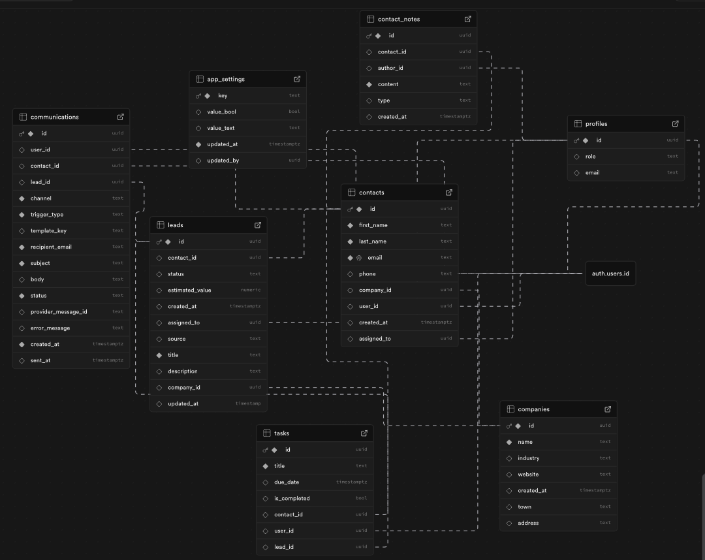
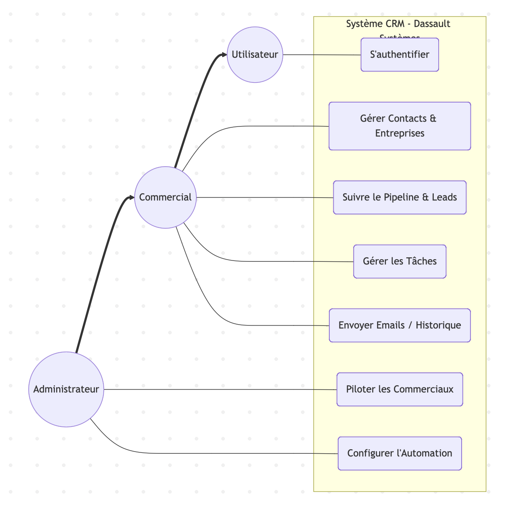

# Rapport de Projet CRM : Dassault Systèmes

## Informations Générales
* **Formation :** Master MIAGE / Communication Digitale
* **Projet :** Développement d'un CRM web en architecture cloud moderne / full SaaS
* **Étudiante :** Léa Mougel
* **Dépôt GitHub :** [https://github.com/lea-mougel/Projet_CRM](https://github.com/lea-mougel/Projet_CRM)
* **Application Live :** [https://projet-crm-nine.vercel.app/login](https://projet-crm-nine.vercel.app/login)

---

## 1. Synthèse du Projet
Ce projet consiste en la conception et la réalisation d'une application web de type CRM (Customer Relationship Management) complète. L'objectif est de centraliser les données clients, d'automatiser les communications marketing et d'analyser les performances commerciales via des tableaux de bord. La solution repose sur une architecture SaaS moderne permettant une scalabilité immédiate et une sécurité gérée par les plateformes.

---

## 2. Analyse des Besoins (Contexte Dassault Systèmes)
Le CRM a été adapté pour répondre aux enjeux de **Dassault Systèmes**, où le cycle de vente de logiciels complexes (B2B) nécessite un suivi rigoureux.
* **Gestion des prospects :** Centralisation et suivi des leads depuis la prise de contact jusqu'à la conversion.
* **Pipeline métier :** Mise en place d'un tunnel de vente personnalisé pour visualiser l'étape du cycle de vente (Démonstration, POC, Négociation).
* **Automatisation :** Envoi d'emails automatiques suite aux interactions des utilisateurs avec les produits. (pas encore fonctionnel)

---

## 3. Architecture Technique

| Composant | Technologie | Rôle |
| :--- | :--- | :--- |
| **Frontend** | **React / Next.js** | Interface moderne, responsive et gestion du routing dynamique. |
| **Backend** | **NestJS / Node.js** | Logique métier et création d'une API REST sécurisée. |
| **Base de données** | **PostgreSQL (Supabase)** | Gestion et stockage des données relationnelles. |
| **Authentification** | **Supabase Auth** | Gestion sécurisée des accès et des rôles utilisateurs. |
| **Emailing** | **Brevo API** | Automatisation des campagnes et historique des envois. |
| **Déploiement** | **Vercel** | Hébergement cloud avec déploiement continu via GitHub. |

---

## 4. Modélisation des Données (MCD)

### Diagramme de Use Case

---

## 5. Fonctionnalités Implémentées
L'application CRM intègre les modules fondamentaux requis par le cahier des charges :
* **Authentification & Rôles :** Système de login/logout avec gestion des permissions admin et commercial.
* **Pipeline de vente :** Visualisation graphique du funnel de conversion et suivi des étapes de vente.
* **Gestion des tâches :** Création de rappels et planification de rendez-vous.
* **Dashboard Analytique :** Affichage des indicateurs de performance (KPI) sur les leads et les conversions.
* **Communication :** Programmation d'emails automatiques et modèles personnalisables. (pas encore fonctionnel)

---

## 6. DevOps et Workflow
* **Gestion de version :** Utilisation de Git et GitHub pour le suivi du code et la collaboration par branches.
* **CI/CD :** Connexion directe entre GitHub et Vercel pour un déploiement continu en production.
* **Sécurité :** Configuration de variables d'environnement pour protéger les clés API et les accès à la base de données.

---

## 7. Conclusion
L'etude de ce projet CRM full-stack montre qu'une architecture Full SaaS (Supabase, Vercel, Brevo) repond efficacement aux besoins d'un contexte B2B comme Dassault Systemes. Cette analyse met en evidence des choix techniques pertinents pour centraliser les donnees clients, structurer le pipeline commercial et automatiser la communication, tout en conservant une solution evolutive et maintenable.

---

## Annexes
* **Code Source :** [GitHub Repository](https://github.com/lea-mougel/Projet_CRM)
* **Application Déployée :** [Lien Vercel](https://projet-crm-nine.vercel.app/login)